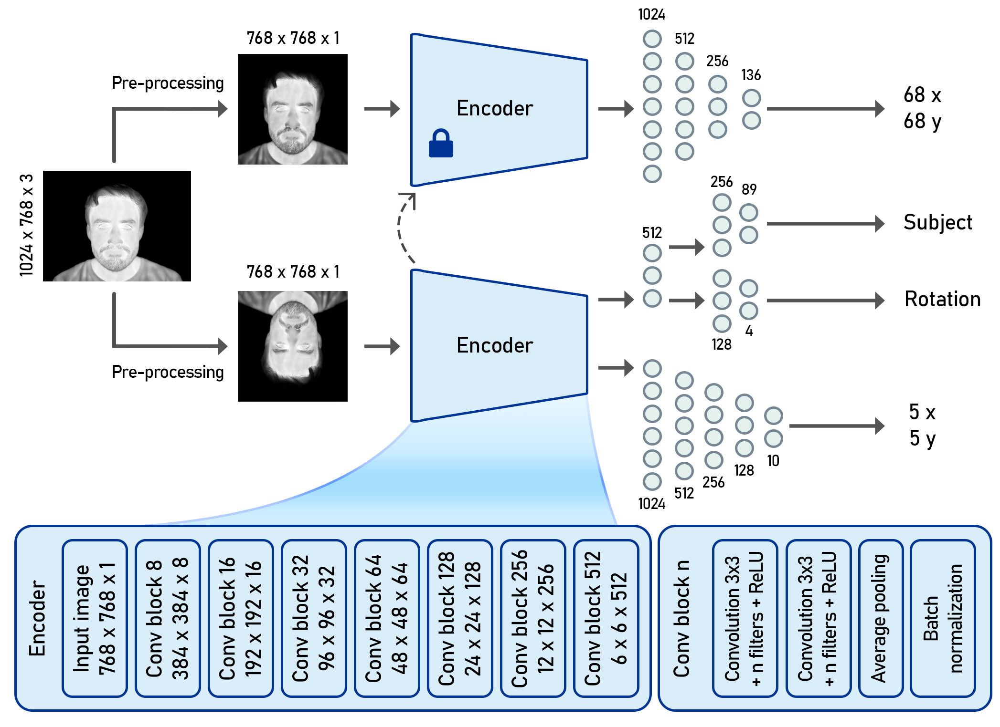
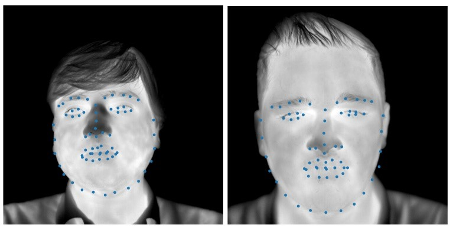

# SSL-Keypoint-Detection-in-Thermal-Images
Leveraging Self-Supervised Learning for Accurate Facial Keypoint Detection in Thermal Images

- [Abstract](#abstract)
- [File Structure](#file-structure)
- [Setup and Installation](#setup-and-installation)
- [Usage](#usage)
- [Results](#results)
- [Credits](#credits)
- [License](#license)

## Abstract
In the realm of computer vision, the pursuit of precise keypoint detection continues to evolve, finding applications in diverse domains such as face recognition, facial region tracking, and facial expression analysis. This project focuses on developing a meticulously designed algorithm tailored for accurate facial keypoint detection in thermal images. The repository encompasses pretext training, downstream training, evaluation, and analysis of the trained model's performance.

Poorya Aghaomidi, Sadaf Aram, Zahra Bahmani. "Leveraging Self-Supervised Learning for Accurate Facial Keypoint Detection in Thermal Images." 

## File Structure
The repository is organized as follows:

- `Src`: Jupyter Notebook codes for pretext and downstream trainings
- `Docs`: Related documents to the project

## Setup and Installation
1. Clone the repository: `git clone https://github.com/PooryaAghaomidi/SSL-Keypoint-Detection-in-Thermal-Images.git`
2. Install dependencies: `pip install -r requirements.txt`
3. Install `cuda` and `cudnn` if you want to work with GPU

## Usage
- The `pretext_training.ipynb` notebook handles self-supervised learning and pretext training.
- The `downstream_training.ipynb` notebook fine-tunes the model on a specific task.

## Results

This section includes some visualized results or performance metrics obtained from the trained models. Use the provided functions to embed images and share outcomes from the project.

An illustrative example of the outcomes achieved through our proposed downstream task:

## Credits

    Created by Poorya Aghaomidi
    Based on project requirements for Tarbiat Modares University

## License
If you use this repository or find the code useful for your research, please consider citing the associated paper.

